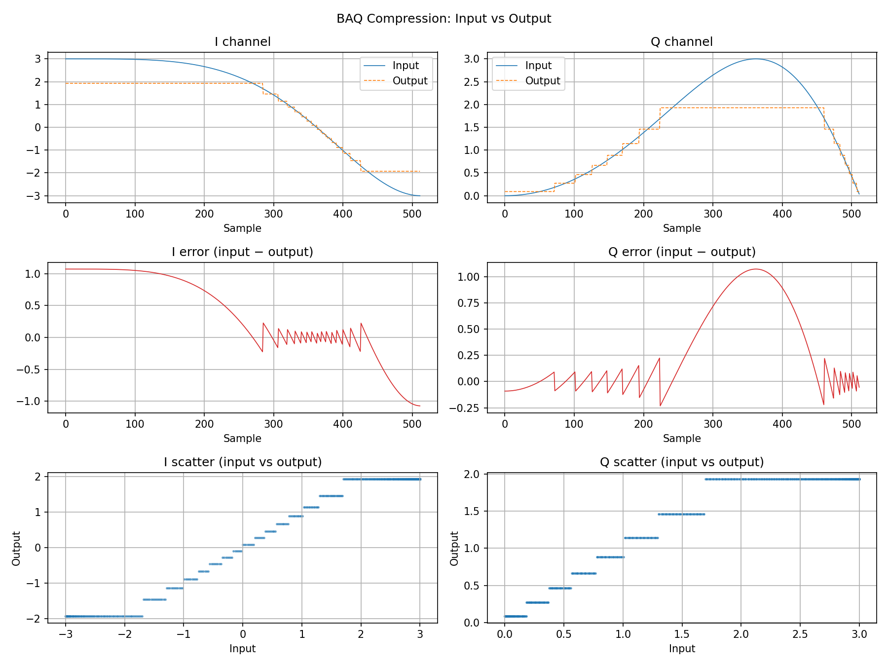

# BAQ

Block Adaptive Quantization (BAQ) compressor and decompressor verification model.

## Diagram

`diagram/baq_plot.png` shows a round-trip through the BAQ codec using a linear chirp input (512 samples, 4-bit mode):

- **Top row**: I and Q channels with the original chirp overlaid against the reconstructed output.
- **Middle row**: Sample-wise error (input − output), showing quantisation noise that grows where the signal changes rapidly.
- **Bottom row**: Scatter of input vs output values, revealing the discrete reconstruction levels produced by the non-uniform quantiser.
